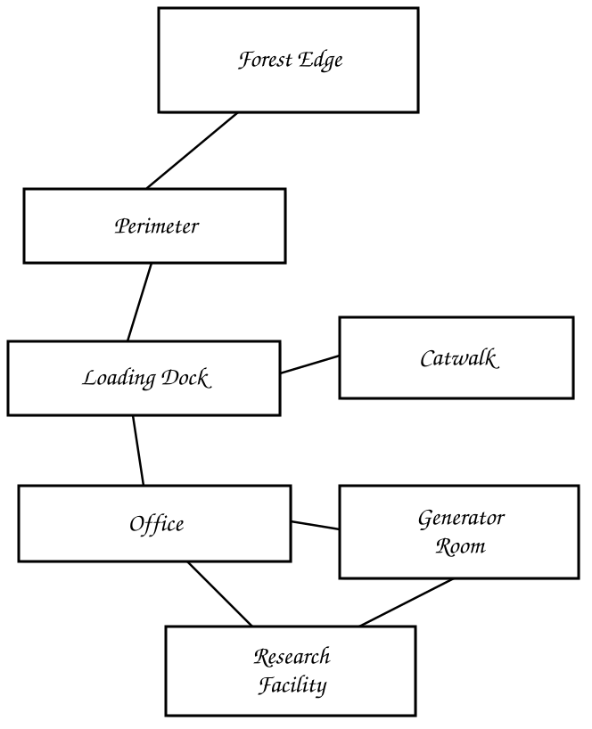

## Tactical Zones

Once the game switches to *combat mode*, the GM organizes your battlespace into *tactical zones*. Tactical zones represent the surrounding areas in combat without precise measurements, grids, or detailed battle maps and miniatures. They provide enough structure for fast-paced action, decision-making, and interaction with the tactical environment.

### Moving Through Zones

Characters move *between tactical zones* rather than calculating distance and movement rates. Entering an adjacent zone consumes **1** movement action, regardless of the zone’s size. You can spend your second action in the *combat round* to move again and enter another adjacent zone. 

Boundaries between zones or within a zone can complicate movement:

- **Difficult terrain** (rubble, standing water, thick smoke): costs 2 actions to move through, one for movement and one for an action in the combat round.
- **Free actions**: slipping through an open interior door or moving within the same tactical zone. No movement action is required; the GM narrates the transition.
- **Hazardous environment** (poison gas, flame): Movement through the zone may cause damage without protective gear.
- **Suppressed zone**: entering a zone under active enemy fire requires a *free-fire check*; if you fail, you stop short or go to ground. See [Free-Fire Opportunities](combat.md#free-fire-opportunities).

## Zone Distances

Range is measured in zone hops, i.e., the number of zone boundaries between you and a target along connections.

| Hops | Tactical Zone |
|---|---|
| 0 | **Close**: same tactical zone |
| 1 | **Nearby**: across a room or over a barrier |
| 2 | **Far**: across a street or through a window |
| 3 | **Distant**: across a field |
| 4+ | **Extreme**: several city blocks |

Count the *shortest* path through connected zones — not a straight line on a map.

### Zone Weapon Ranges

The *optimal engagement ranges* for your weapons use the number of tactical zone hops to determine their *advantages*, *disadvantages*, and *impossible* attack modifiers. 

See [Optimal Engagement Distance](combat.md#optimal-engagement-distance).

### Zones Example

For example, your objective area could be divided into several tactical zones as follows:

<figure>

<figcaption>Tactical Zones</figcaption>
</figure>

| Zone | Description |
| - | - |
| Forest edge | Total cover, blanketed in snow |
| Kill Zone | An open, exposed field covered in deep snow |
| Main floor | Filled with crates and forklifts, with an open exterior |
| Catwalks | Rusted walkways above the main floor |
| Office | Enclosed with windows and a solid cover |
| Generator | Secured behind a locked door |
| Research facility | A laboratory containing volatile chemicals |

Decisive tactical and movement actions emerge and resolve quickly in-game. The combat scene unfolds at a faster pace, with a more cinematic feel than plotting grid positions. 

1. Observe from the forest edge. 
2. Suppress, smoke screen, and bounding overwatch across the kill zone; snow slows movement. 
3. Suppress the main floor; advance under cover; the catwalk provides overwatch and has a line of sight through office windows, though it may collapse. 
4. Breach and flank through the office.
5. Blow the door; blow the generator.
6. Breach the facility from both entrances. 

No rulers, no math. Decisions, *action rolls*, and results. Grid combat asks, “*Where is everyone standing*?” Zone combat asks, “*Which part of the tactical landscape are you leveraging*?”
